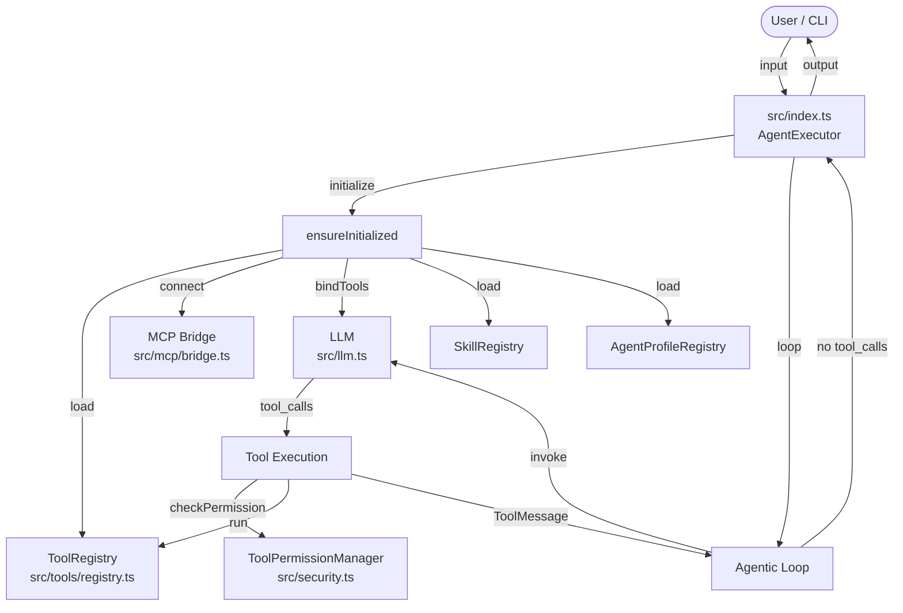
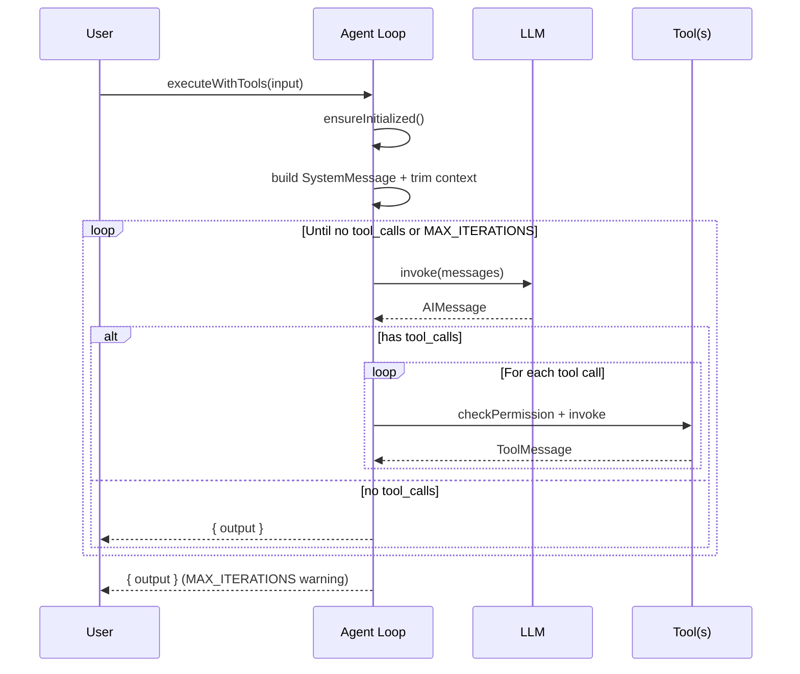
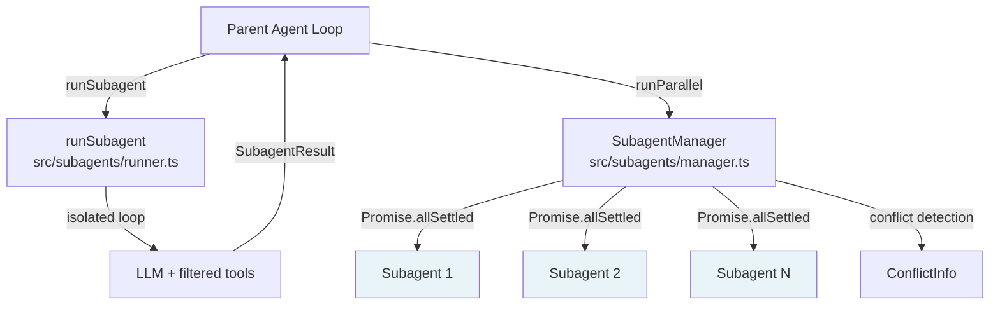
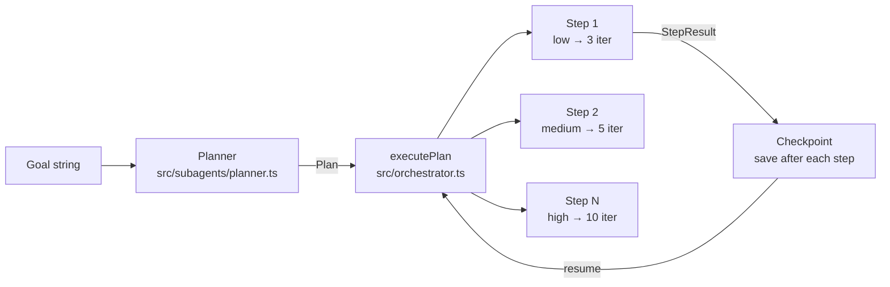
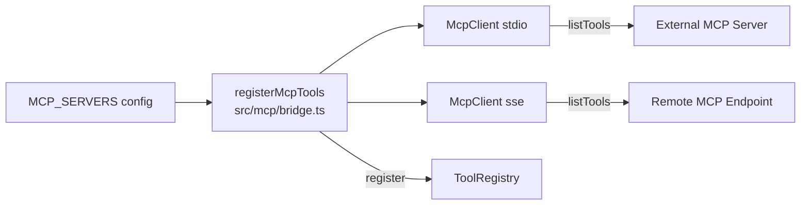
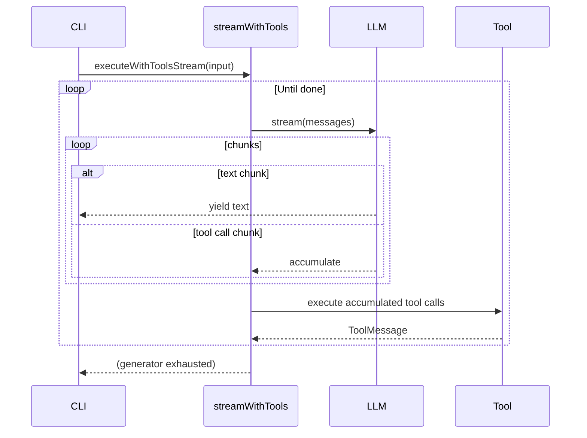

# Architecture

## System Overview

AgentLoop is a TypeScript runtime that implements a tool-using agentic loop on top of [LangChain](https://js.langchain.com/) and [Mistral AI](https://mistral.ai/). The agent receives a natural-language task, calls tools iteratively until the task is complete, and returns a final text response.

---

## Agent Loop Flow

The main loop in `src/index.ts` follows this sequence on every invocation:

**Key behaviours:**

- `ensureInitialized()` runs exactly once — it loads all tools from `src/tools/`, connects MCP servers, binds them to the LLM with `bindTools()`, and loads prompt templates, skills and agent profiles.
- Each LLM call is wrapped in an exponential back-off retry (`src/retry.ts`) and an `AbortController`-based timeout.
- Tool calls are executed through `ToolPermissionManager` (blocklist / allowlist / permission level) and `ConcurrencyLimiter`.
- Tool results are re-injected as `ToolMessage` entries so the LLM can reason about them in the next iteration.
- The context window is trimmed to `MAX_CONTEXT_TOKENS` tokens before each LLM call (`src/context.ts`).
- Every invocation produces a structured trace via `Tracer` (`src/observability.ts`) when `TRACING_ENABLED=true`.

---

## Module Map

| Module | Responsibility |
|---|---|
| `src/config.ts` | Dotenv initialization; exports `appConfig` with all runtime settings |
| `src/index.ts` | Main agentic loop, streaming variant, CLI REPL, `agentExecutor` export |
| `src/llm.ts` | `createLLM()` factory; provider switch block |
| `src/tools/registry.ts` | `ToolRegistry` class; `loadFromDirectory()` for dynamic tool discovery |
| `src/tools/*.ts` | Individual tool definitions; each exports a `toolDefinition` constant |
| `src/security.ts` | `ToolPermissionManager`, `ConcurrencyLimiter`, `checkNetworkAccess` |
| `src/context.ts` | Token counting and context trimming |
| `src/retry.ts` | `withRetry()`, `invokeWithTimeout()` |
| `src/streaming.ts` | `streamWithTools()` — streaming agent loop with chunk assembly |
| `src/observability.ts` | `Tracer`, `FileTracer`, `NoopTracer`, per-invocation JSON traces |
| `src/mcp/client.ts` | `McpClient` — MCP SDK wrapper for stdio/SSE transports |
| `src/mcp/bridge.ts` | `registerMcpTools()` — translates MCP tools into `ToolDefinition` entries |
| `src/subagents/runner.ts` | `runSubagent()` — isolated agent loop for a single subagent |
| `src/subagents/manager.ts` | `SubagentManager` — sequential and parallel subagent execution |
| `src/subagents/planner.ts` | LLM-driven planner that produces a `Plan` from a goal description |
| `src/orchestrator.ts` | `executePlan()` — plan execution with retry/skip/abort and checkpointing |
| `src/prompts/system.ts` | `getSystemPrompt()` — assembles the runtime system prompt |
| `src/prompts/registry.ts` | `PromptRegistry` — versioned prompt template storage |
| `src/prompts/context.ts` | `getCachedPromptContext()` — TTL-cached runtime context injection |
| `src/skills/registry.ts` | `SkillRegistry` — loads and exposes skill definitions |
| `src/agents/registry.ts` | `AgentProfileRegistry` — loads agent profile JSON/YAML files |
| `src/agents/activator.ts` | `activateProfile()` — applies a profile's overrides to runtime config |
| `src/workspace.ts` | `analyzeWorkspace()` — detects language, framework, and lifecycle commands |
| `src/logger.ts` | Structured Pino logger; configured from `appConfig.logger` |
| `src/errors.ts` | `ToolExecutionError`, `ToolBlockedError` typed error classes |

---

## Subagent Architecture

Subagents are isolated agent loops that run a focused task with a restricted tool set. They do not share message history with the parent and communicate only through their return value.

**Parallel execution conflict detection:** `SubagentManager.runParallel()` uses the optional `mutatesFile` hook on each `ToolDefinition` to track which files each subagent wrote to. Conflicts (same file modified by more than one subagent) are reported in `ParallelResult.conflicts`.

---

## Plan Execution (Orchestrator)

The orchestrator executes a `Plan` — a sequence of `PlanStep` objects — produced by `Planner`. Each step runs as a subagent with an iteration budget derived from its `estimatedComplexity`.

Failure strategies per step: `retry` (default), `skip`, or `abort`.

---

## MCP Integration

The Model Context Protocol (MCP) bridge connects to external tool servers at startup and registers their tools in the local `ToolRegistry` so the agent loop treats them identically to built-in tools.

Each MCP tool's JSON Schema is converted to a Zod schema at registration time. The `McpClient` also supports sampling callbacks (MCP server requests an LLM completion) and resource/prompt discovery.

---

## Streaming Mode

When `STREAMING_ENABLED=true`, the agent loop switches to `streamWithTools()` in `src/streaming.ts`. The LLM is called via `.stream()`, text chunks are yielded immediately, and `ToolCallChunk` fragments are accumulated until a complete tool call is assembled before execution.

